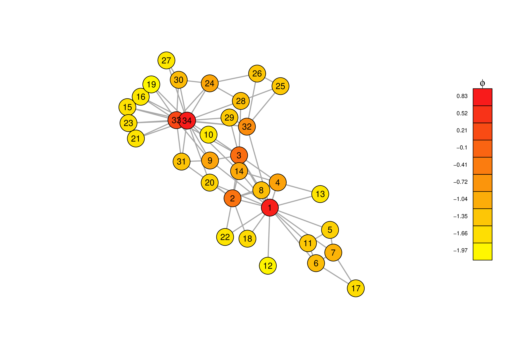
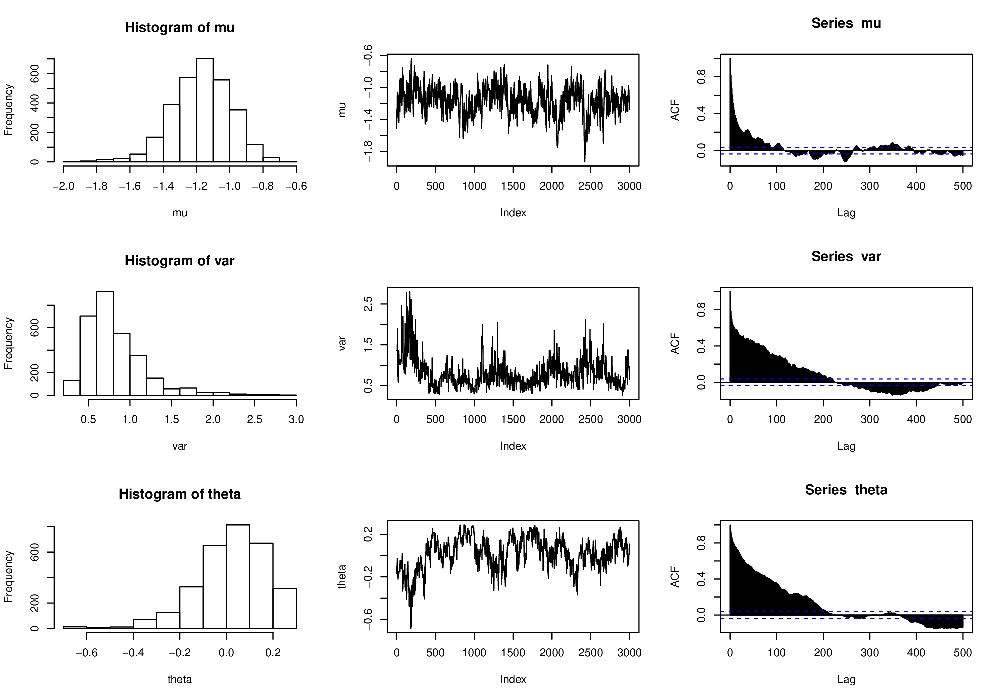

# Bayesian Exponential Random Graph Model with Nodal Random Effects

Implementation for the bayesian approach of the Exponential Random Graph Model (ERGM) including nodal random effects to compensate for heterogeneity in the nodes of a network [1].

Most of statistical models for network data assumes that the local structure of the network is homogeneous. Phenomena such as a small-world effect, where path lengths tend to be very small, and scale-free networks, where few nodes have high degree, are not well modelled using these models. This extension of the ERGM avoids the assumption of node homogeinity by adding nodal random effects. And by using the bayesian strategy for ERGMs [2], we can easily estimate the parameters.

The base code implements only the triangle feature and the random effect for each vertex. Feel free to fork it and improve it. 

## Running the code
Open a terminal and run th command below
```bash
Rscript src/main.r input_file > logs/output_file
```
where *input_file* is the list of edges of a given graph. Note the starting vertex has to be zero. (if your graph starts from one, you can use *utils/edgelist_model.py* to fix it) All messages will be redirected to *output_file*, and you can use *utils/log_parser.py* to generate a csv file with the values for all iterations from the output.  

## Plots
For example, running for the *Zachary's Karate Club* data, we obtain the following plots:

||
|:--:|
| *Zachary’s Karate Club Graph. Vertices are coloured by their estimated nodal effect (posterior mean). Vertices with a high nodal effect are darker in red.* |

From the above plot, we can estimate which vertices have the most tendency for new interactions. From the below, we notice that the value for the triangle parameter (theta) might indicate that the graph does not have more triangles than what we would expect from random edges (maybe a small positive or negative influence). 

||
|:--:|
| *Posterior densities histogram, trace plots, and autocorrelation for the model for the karate club data.* |

And below we have a glimpse of the parsed log file. We can use it to a deeper study of the simulations. The values for the nodal effect are not currently in the log files, but that is easy to change in *src/main* and *utils/log_parser.py*.

|iter|theta|mu|var|
|:---:|:---:|:---:|:---:|
|1|-0.00481083671749184|0.0573217875925029|0.876975475344807|
|2|-0.0702714743116702|0.198311243356463|0.876975475344807|
|3|-0.133136619958839|0.224882748356274|0.876975475344807|
|4|-0.133136619958839|0.224882748356274|0.970957030309212|
|5|-0.206727617627911|0.268107283617247|0.970957030309212|
|6|-0.206727617627911|0.276731514323569|0.970957030309212|
|7|-0.206727617627911|0.157065392002656|1.17365886896579|
|8|-0.325341979410071|0.174688138208296|1.17365886896579|
|9|-0.492041329740009|0.129023917263488|1.17365886896579|

## Parameters
You can also change the initial values for all priors and hyperpriors parameters in *src/main.r*. And, of course, change the number of main iterations for the MCMC and auxiliary iterations for sampling the graph. 

## Sampling
Since it is part of the main algorithm, you can also just sample graphs using *src/sample_matrix.r* and plot them using *src/plot.r*. It's quite interesting how these random graphs behave as we change the model parameters.

The paper actually uses a different (and more efficient) algorithm for sampling graphs, but I couldn't find how it worked. So have this in mind if you want to sample huge graphs.

## References
[1]  S. Thiemichen, N. Friel, A. Caimo, and G. Kauermann.  Bayesian exponential random graph models with nodal random effects. *Social Networks*, 46:11 – 28, 2016.

[2]  Alberto Caimo and Nial Friel. Bayesian inference for exponential random graph models. *Social Networks*, 33(1):41 – 55, 2011.
